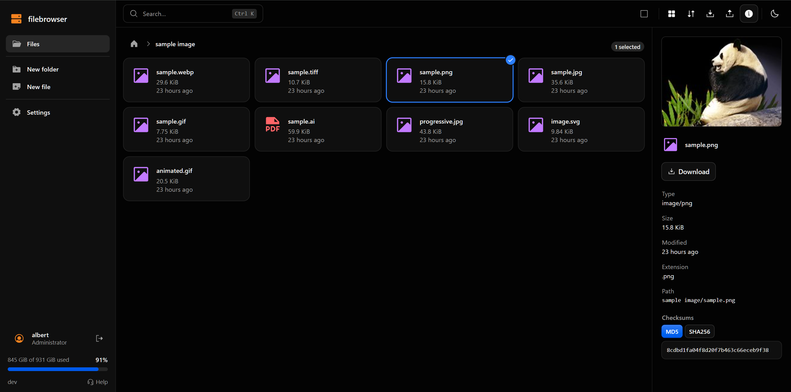

# File Browser

A web file browser served by a single Go binary with an embedded React app.
Anyone can browse, upload, and download. Optional accounts add
file management: create, rename, move, delete, and private folders. Account
data lives in a SQLite database; files stay on the plain filesystem.



## Quick start

### Docker Compose (recommended)

```yaml
services:
  filebrowser:
    image: ghcr.io/skidoodle/filebrowser:latest
    container_name: filebrowser
    restart: unless-stopped
    ports:
      - "8080:8080"
    volumes:
      - ./data:/data
      - ./db:/db
```

```bash
docker compose up -d
```

Then open http://localhost:8080. The first visit offers to create an admin
account.

### Custom UID/GID

By default the container runs as `1000:1000`. If your host volumes are owned by
a different user, set `PUID` and `PGID`:

```yaml
services:
  filebrowser:
    image: ghcr.io/skidoodle/filebrowser:latest
    ports:
      - "8080:8080"
    environment:
      - PUID=1001
      - PGID=1001
    volumes:
      - /mnt/nas/files:/data
      - ./db:/db
```

The entrypoint automatically fixes ownership of `/data`, `/cache`, and `/db`
before dropping privileges. This also works when bind-mounting multiple
filesystems under `/data`:

```yaml
    volumes:
      - /mnt/ssd/documents:/data/documents
      - /mnt/hdd/media:/data/media
      - ./db:/db
```

> [!NOTE]
> If you use `user: "1001:1001"` in compose instead of `PUID`/`PGID`, the
> entrypoint skips the ownership fix and execs directly. Make sure your volumes
> are already writable by that UID.

### Build from source

Requires Go 1.26+ and Bun:

```bash
just build
FILEBROWSER_ROOT=./data ./bin/filebrowser
```

## Configuration

All settings come from environment variables.

| Variable | Default | Meaning |
| --- | --- | --- |
| `PUID` | `1000` | user ID the process runs as (Docker only) |
| `PGID` | `1000` | group ID the process runs as (Docker only) |
| `FILEBROWSER_ROOT` | `./data` | directory served to visitors |
| `FILEBROWSER_DATABASE` | `./filebrowser.db` | path to SQLite database |
| `FILEBROWSER_ADDRESS` | `0.0.0.0:8080` | listen address |
| `FILEBROWSER_BASEURL` | empty | subpath the app is mounted under |
| `FILEBROWSER_ACCESS_POLICY` | `public` | `public` lets anonymous visitors upload, `readonly` limits them to browsing, `private` requires sign-in for everything |
| `FILEBROWSER_MAXUPLOAD` | `10GiB` | maximum size of a single upload |
| `FILEBROWSER_CACHEDIR` | system temp | directory for thumbnails and other disposable data |
| `FILEBROWSER_MAXTEXTSIZE` | `10MiB` | cutoff for text type detection |
| `FILEBROWSER_GUARD` | `true` | toggle the abuse-protection chain |
| `FILEBROWSER_TRUSTEDPROXIES` | empty | comma-separated proxy CIDRs for `X-Forwarded-For` |
| `FILEBROWSER_REQUESTRATE` | `60` | per-IP API requests per second |
| `FILEBROWSER_DOWNLOADRATE` | `200MiB` | per-IP download bytes per second |
| `FILEBROWSER_POWDIFFICULTY` | `4` | proof-of-work difficulty, 0 disables it |
| `FILEBROWSER_SECRET` | empty | capability signing key; defaults to a key persisted in the cache dir |
| `FILEBROWSER_INSECURE` | `false` | disable authentication, give every visitor full access |
| `FILEBROWSER_ADMIN_PASSWORD` | empty | seed or reset the admin password |
| `FILEBROWSER_DEBUG` | `false` | verbose logging |

## Development

```bash
just dev      # API on :8080 and Vite dev server on :5173
just test     # Go tests with the race detector
just lint     # golangci-lint
just fmt      # gofmt and go vet
just build    # production binary with the embedded SPA
```

Run `just --list` for the rest. The backend is Go 1.26+ on the standard
library. The frontend is React 19, TypeScript, Vite, and Tailwind CSS, built
with Bun.

## License

BSD 3-Clause. See [LICENSE](LICENSE).
